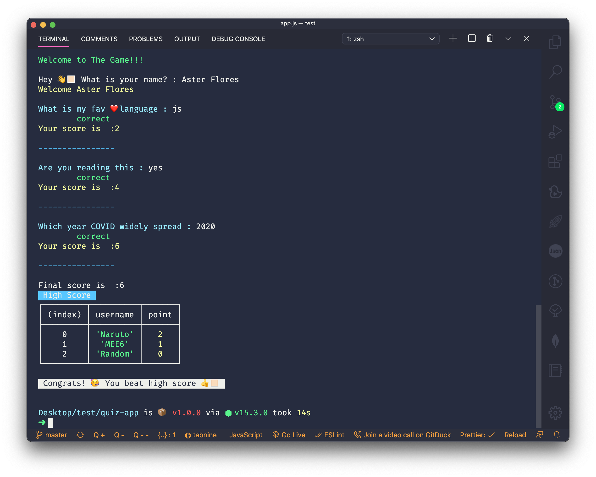

[](https://forthebadge.com)

# Node CLI Quiz App

### Demo



## Setting up the enviorment

We will use two **node modules**:

1. **readline-sync:** It can take input in various manner from user
 
2. **chalk:** it is an expressive api which adds colors and styling


### Final code:

```javascript
// importing modules
const rs = require('readline-sync');
const chalk = require('chalk');

console.log(chalk.green.bold('Welcome to The Game!!!\n'));
// user input
var playerName = rs.question('Hey 👋🏻 What is your name? : ');
// greeting user
console.log(chalk.yellow(`Welcome ${playerName}\n`));
// global varibale to keep account of socre
var score = 0;
// a function to check whether user answer is correct or not
function gamePlay(questions, correctAnswer) {
    var answer = rs.question(chalk.cyanBright(questions));
    if (answer == correctAnswer) {
        console.log(chalk.green('\tcorrect'));
        score = score + 2;
    } else {
        console.log(chalk.red('\twrong'));
        console.log(chalk.greenBright('Correct Answer is: ' + correctAnswer));
        score = score - 1;
    }
    console.log(chalk.yellowBright('Your score is  :' + score));
    console.log(chalk.blue('\n----------------\n'));
}
// creating qus answer objects
var firstQus = {
    qus: 'What is my fav ❤️ language : ',
    ans: 'js',
};
var secondQus = {
    qus: 'Are you reading this : ',
    ans: 'yes',
};
var thirdQus = {
    qus: 'Which year COVID widely spread : ',
    ans: '2020',
};
// list of all qus answer
qusArray = [firstQus, secondQus, thirdQus];
// calling function
for (let i = 0; i < qusArray.length; i++) {
    gamePlay(qusArray[i].qus, qusArray[i].ans);
}
console.log('Final score is  :' + score);
// array of high score
highScore = [
    {
        username: 'Naruto',
        point: 2,
    },
    {
        username: 'MEE6',
        point: 1,
    },
    {
        username: 'Random',
        point: 0,
    },
];
// displaying high score
console.log(chalk.bgBlue(' High Score '));
console.table(highScore);
// getting high score
var max = highScore[0].point;
for (let i = 1; i < highScore.length; ++i) {
    if (highScore[i].point > max) {
        max = highScore[i].point;
    }
}
// checking if user beat the high score
if (score > max) {
    console.log(
        chalk.inverse.bold('\n Congrats! 🥳 You beat high score 👍🏻 \n')
    );
} else {
    console.log(chalk.inverse.bold('\n Better Luck Next Time 😉 \n'));
}
```